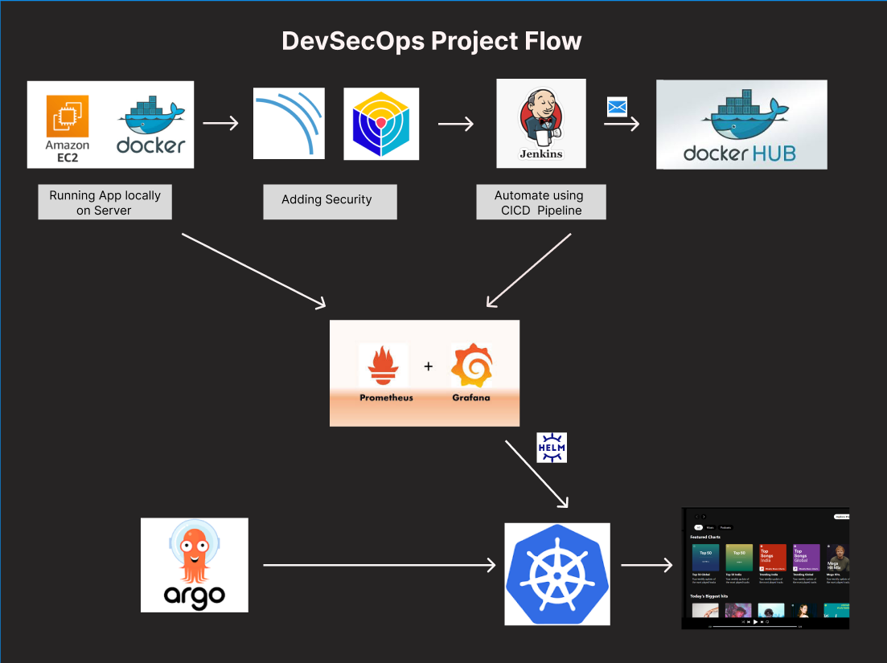

---

########Deploy Static Music Website on Cloud using Jenkins – DevSecOps Project

---

###### Deployment Steps

#### Option 1: EC2 Instance Connect 

AWS provides **EC2 Instance Connect**, which lets you connect directly from your browser without using SSH keys.

**Steps:**

1. Go to your EC2 instance in the **AWS Management Console**.  
2. Select your instance → Click **Connect** → Choose **EC2 Instance Connect**.  
3. Click **Connect**. A terminal opens in your browser.

#### Step 2: Clone the Repository

Update the system packages and clone the project repository:

```bash
sudo apt-get update -y
git clone https://github.com/Sakshi2509patil/DevSecOps-Pipeline.git
cd DevSecOps-Pipeline

####Step 3: Install Docker and Run the Application in a Container
##3.1 Install Docker

Update packages, install Docker, add your user to the Docker group, and set permissions:

```bash
sudo apt-get install docker.io -y
sudo usermod -aG docker $USER
newgrp docker
sudo chmod 777 /var/run/docker.sock

##3.2 Build the Docker Image

Build the Docker image for MelodyZone:

```bash
docker build -t melodyzone .

##3.3 Run the Docker Container

Run the container and map port 8081 to 80:

```bash
docker run -d --name melodyzone -p 8081:80 melodyzone:latest

##3.4 Stop & Remove Container/Image (Optional)

To stop the container:

```bash
docker stop <container_id>

To remove the Docker image:

```bash
docker rmi -f melodyzone
---
